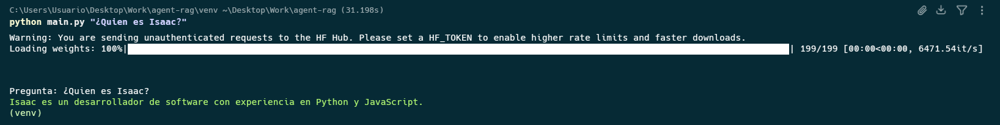

# RAG (Retrieval-Augmented Generation) Agent Example

Poyecto de ejemplo para un agente RAG (Retrieval-Augmented Generation) utilizando LangChain, Ollama y SentenceTransformer.

## Requisitos

- Python 3.14.3 o superior
- Ollama (instalado y en ejecución)

## Instalación

1. Clona este repositorio:

   ```bash
   git clone https://github.com/epmyas2022/agent-rag.git
    ```

2. Navega al directorio del proyecto:

    ```bash
    cd agent-rag
    ```

3. Instala las dependencias:

    ```bash
    pip install -r requirements.txt
    ```

## Uso


